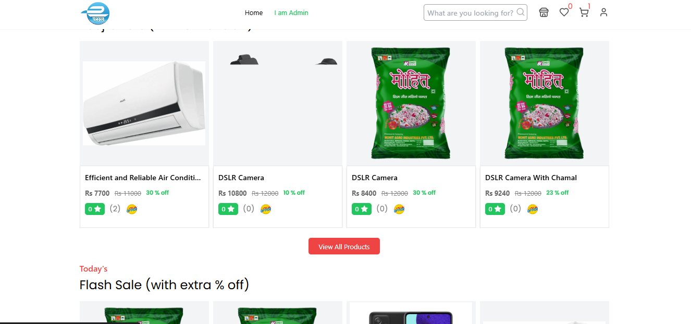
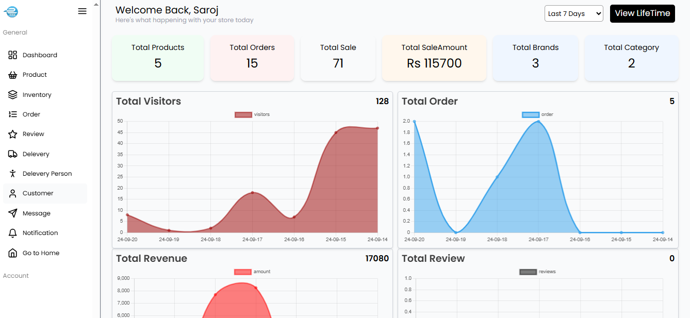
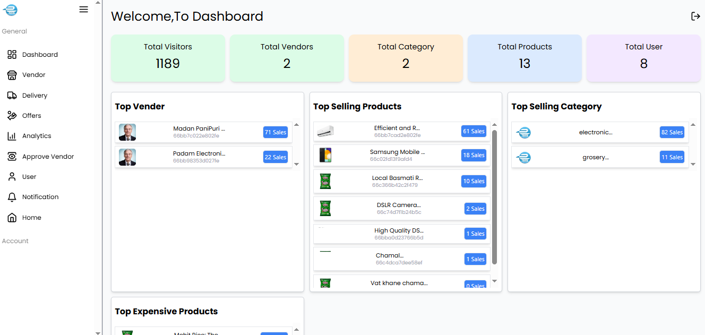
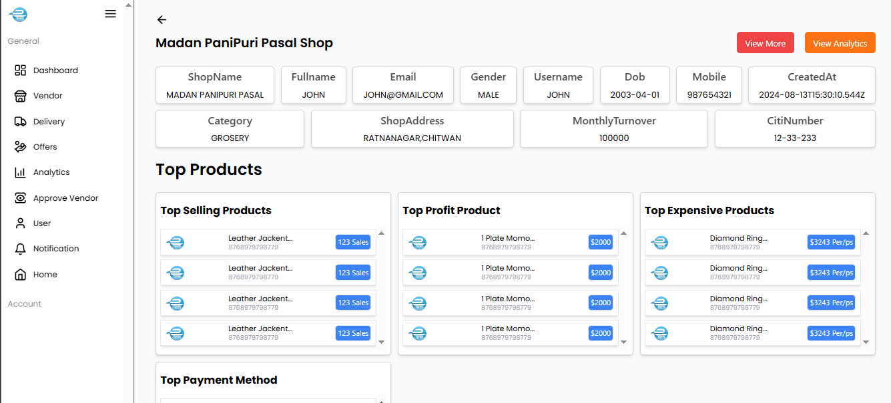
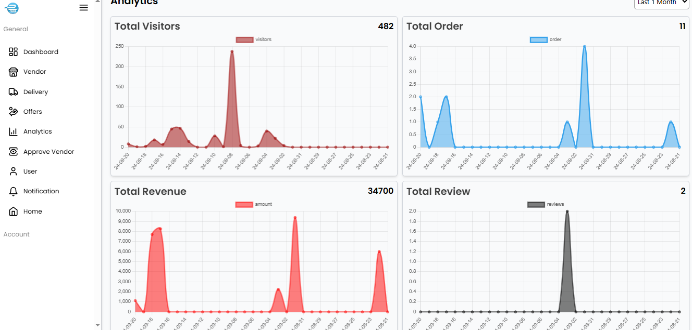
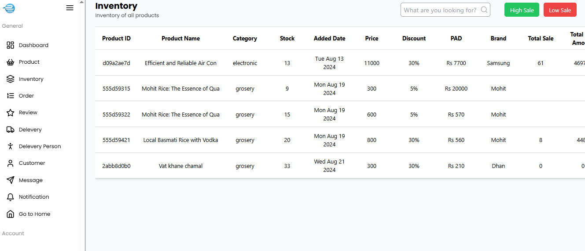
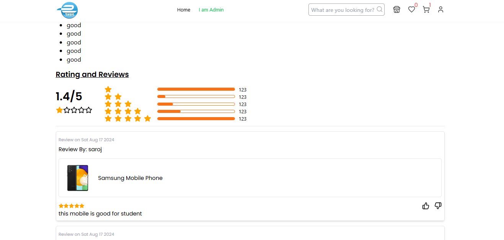
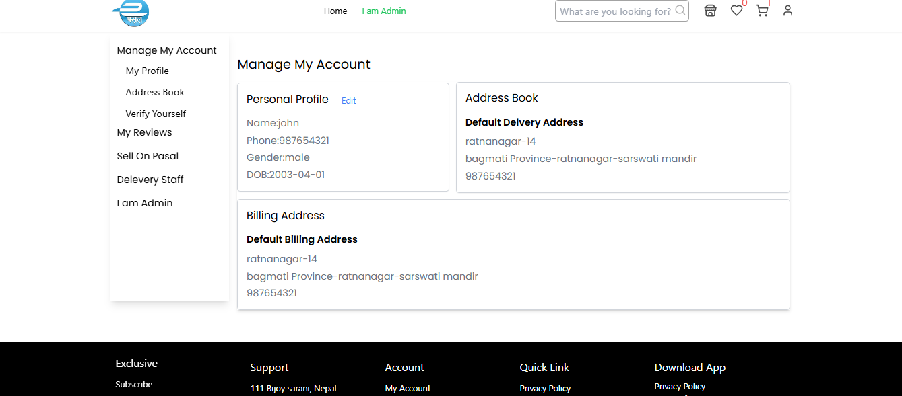
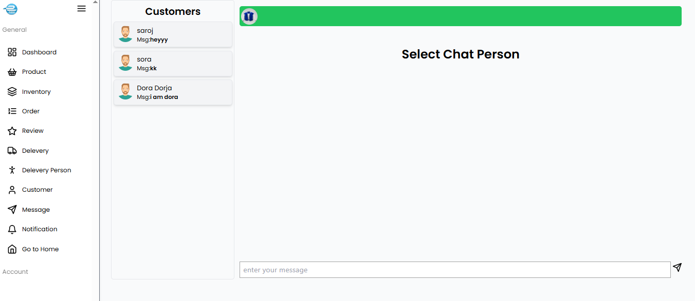
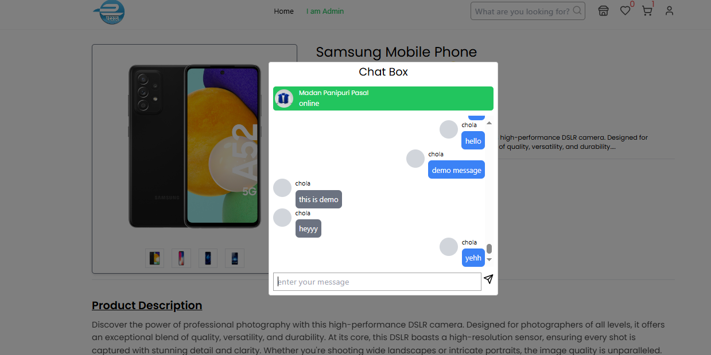

# 🛍️ Multi-Vendor eCommerce Platform

A full-featured multi-vendor eCommerce platform that allows multiple sellers to create their own stores and sell products in a unified marketplace. This application is designed to provide a seamless experience for both vendors and customers, offering a range of features such as product management, order processing, and payment integration. It is suitable for small startups as well as larger marketplaces.

## ✨ Features

- **Multi-Vendor Support:** 🛒 Vendors can create individual stores, manage their products, and handle their own orders.
- **Product Management:** 📦 Comprehensive product management for vendors, including adding, editing, and deleting products.
- **Order Management:** 📑 A streamlined order management system for vendors to track and fulfill customer orders.
- **Customer Accounts:** 👤 Secure customer registration, login, and profile management.
- **Search and Filtering:** 🔍 Advanced product search and filtering options for customers to easily find products.
- **Shopping Cart and Checkout:** 🛒 A user-friendly shopping cart and checkout process with support for multiple payment gateways.
- **Admin Dashboard:** 🛠️ An intuitive admin dashboard for managing the overall marketplace, monitoring sales, and moderating vendor activities.
- **Email Notifications:** ✉️ Automated email notifications for order updates, promotional offers, and more.
- **Analytics & Reports:** 📊 View sales and traffic analytics with interactive graphs and detailed reports to track performance.
- **Responsive Design:** 📱 A mobile-friendly and responsive UI for a seamless shopping experience on any device.
- **Security:** 🔒 Robust security features including data validation, secure payments, and user authentication.
- **Others:** 🛠 Additional features such as wish lists, product reviews, and more to enhance the shopping experience.


## 🛠️ Tech Stack

- **Frontend:** React, Tailwind CSS
- **Backend:** Node.js, Express, MongoDB
- **Authentication:** JWT, OAuth
- **Payment Integration:** E-sewa, Khalti
- **Real-Time Updates:** WebSockets for live chat and order notifications
- **Hosting:** Render, Vercel

## ✔️ Site URL
🌐 [Pasal eCommerce Platform](https://pasal-ecommerce-client.vercel.app/)

> **Note:** Our site is hosted on Render, so it may take a moment for the server to start. Please be patient while it loads. Thank you for your understanding!

## 🖥️ Server Repository
📂 [Pasal eCommerce Server](https://github.com/saroj018/pasal-ecommerce-server)

Explore the server-side codebase also.


## 🚀 Getting Started

To get started with the project, follow these steps:

1. **Clone the repository**:
    ```bash
    git clone https://github.com/saroj018/multi-vendor-ecommerce.git
    ```
2. **Install the dependencies**:
    ```bash
    npm install
    ```
3. **Set up environment variables** for database connections and API keys.
4. **Run the development server**:
    ```bash
    npm run dev
    ```

## 🖼️ Screenshots
Here are some screenshots showcasing the platform's features and user interface:

### Home Page


### Vendor Dashboard


### Admin Dashboard


### Product Details Page


### Vendor Info Page


### Vendor Analytics


### Vendor List 


### User List 


### Seller Inventory Page


### Review Part


### Profile Page


### Offer Create Page


### Seller Chat Page


### Chat Popup


> **Tip:** Add screenshots to the `assets` folder in your repository and use the relative path, e.g., `assets/homepage-screenshot.png`.
